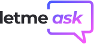
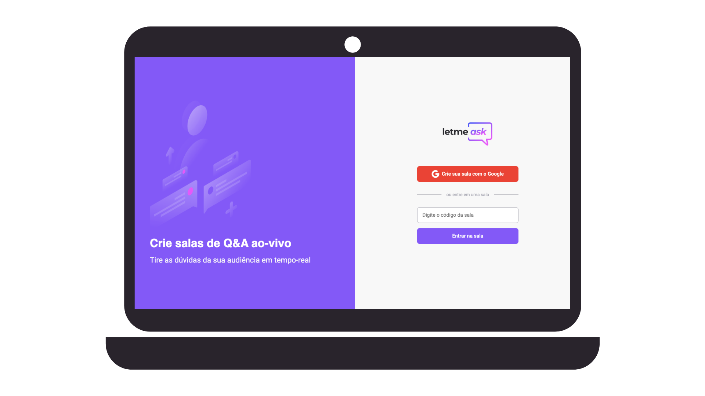
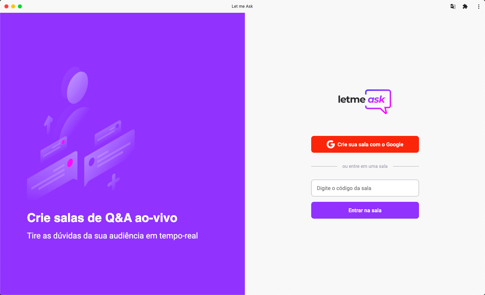

# Sobre o Let me ask

<h1 align="center">
  
</h1>

  <a href="#-tecnologias">Tecnologias</a>&nbsp;&nbsp;&nbsp;|&nbsp;&nbsp;&nbsp;
  <a href="#-projeto">Projeto</a>&nbsp;&nbsp;&nbsp;|&nbsp;&nbsp;&nbsp;
  <a href="#-layout">Layout</a>&nbsp;&nbsp;&nbsp;|&nbsp;&nbsp;&nbsp;
  <a href="#-como-executar">Como executar</a>&nbsp;&nbsp;&nbsp;|&nbsp;&nbsp;&nbsp;
  <a href="#-o-próximo-nível">O próximo nível</a>&nbsp;&nbsp;&nbsp;|&nbsp;&nbsp;&nbsp;
  <a href="#-to-be-done">To Be Done</a>

 

 

  

## ✨ Tecnologias

Esse projeto foi desenvolvido com as seguintes tecnologias:

- [React](https://reactjs.org)
- [TypeScript](https://www.typescriptlang.org/)
- [Firebase](https://firebase.google.com/)
  - _Authentication_: permite login dos usuários com a conta google
  - _Realtime Database_: banco NoSQL que armazena as salas, questões e likes do app.
  - _Firebase Hosting_: hospeda os arquivos estáticos do app(pós build)

Para melhoria da experiência de desenvolvimento:

- [ESLint](https://eslint.org)
- [Prettier](https://prettier.io)

## 💻 Projeto

O Let me Ask é um web app com o objetivo de auxiliar apresentadores e palestrantes a gerenciarem as perguntas que recebem durante um evento ao vivo.

O app permite que os espectadores possam votar(dar like) nas perguntas dos outros e enviar a sua própria pergunta.

Dessa forma, o apresentador poderá visualizar quais foram as perguntas mais votadas e dar prioridade nas respostas.

Ele foi desenvolvido na trilha de React do Next Level Week - Together, evento online promovido pela Rocketseat entre 20 e 27 de junho de 2021.

Faça um teste da versão atual [aqui](https://letmeask-ae3a8.web.app/).

## 🔖 Layout

Você pode visualizar o layout do projeto através [desse link](https://www.figma.com/file/u0BQK8rCf2KgzcukdRRCWh/Letmeask/duplicate). É necessário ter conta no [Figma](http://figma.com/) para acessá-lo.

## 🚀 Como executar

- Clone o repositório
- Crie um projeto do firebase
- Configure o Authentication do projeto para contas do Google
- Configure o Realtime Database (em "primeiros passos" se ainda não tiver feito isso)
- Obtenha suas credenciais do Firebase e substitua no arquivo .env_template, que está na raiz do projeto
- Configure as regras do Realtime Database utilizando o conteúdo do arquivo database.rules.json.
- Instale as dependências do projeto com `yarn`
- Inicie o servidor com `yarn start`

Agora você pode acessar [`localhost:3000`](http://localhost:3000) do seu navegador.

## 💡 O próximo nível

### ESLInt/Prettier

Como a proposta da NLW era que fôssemos além do proposto nas aulas, segui os conselhos do Diego e configurei ESLint e Prettier no ambiente de desenvolvimento.

Inicialmente tentei seguir os vídeos da Rocketseat onde o próprio Diego ensina a fazer as configurações. Porém, acredito que devido à evolução das bibliotecas, foi necessário fazer algumas configurações diferentes e silenciar alguns erros(que poderiam ser solucionados com mais tempo, mas por ora não interferem no projeto).

### PWA

Também segui a ideia de tornar o projeto um PWA(Progressive Web App). Criei e populei os arquivos necessários para isso e também gerei um relatório do Lighthouse (focado em Desktop e PWA) que verificou a "Instalabilidade" do projeto.

Se você acessar a [versão atual do projeto](https://letmeask-ae3a8.web.app/), poderá verificar que o navegador permite fazer a instalação.

Abaixo um print mostrando o funcionamento local, após instalação.

  

# 📓 To be Done

Algumas features do app não puderam ser desenvolvidas, durante a Next Level Week, então deixo aqui registrado o que ainda pode ser melhorado.

## Design básico do produto

- Imagem e texto mostrando que a sala está vazia e sugerindo compartilhar o código com os amigos(admin) ou fazer perguntas(audiência)
- Modal de encerramento de sala(admin)
- Ordenar perguntas pelas mais votadas para ajudar o admin
- Possibilidade de desfazer ações(marcar como respondida, marcar como destaque e apagar)
- Deixar sala sem deslogar(todos)
- Logout(todos)

## Melhorias mais significativas

### _Histórico do usuário_

A ideia seria criar uma tela da aplicação focada no perfil do usuário. Como o login é relacionado à conta do Google, é possível levantar todo o histórico de uso do app por aquele usuário.

Seria legal que o usuário pudesse visualizar, por exemplo, as salas já criadas(e talvez até as visitadas) por ele, bem como as perguntas que ele fez(se visitou) e as perguntas mais votadas de cada sala que criou ou visitou.

### _Gerar relatório de perguntas_

Durante um evento que utiliza o Letmeask, pode acontecer de existir alguma pergunta muito boa, na opinião do apresentador, mas que não foi muito votada(se foi enviada ao final da apresentação é natural que tenha tido menos tempo de votação).

Seria legal que o apresentador pudesse recuperar de forma fácil todas as perguntas da sala. Assim, ele poderia ver quais foram as últimas perguntas, para buscar alguma interessante, e também dar uma olha com mais calma nas outras, mais antigas.

Vamos imaginar ainda que alguém ou alguma empresa produz conteúdo com certa frequência. Seria legal que esse relatório de perguntas pudesse ser enviado a alguém responsável pelo planejamento de conteúdo, para sentir os interesses da audiência e encontrar oportunidades.

Ainda não defini totalmente, mas esse relatório poderia ser criado na própria plataforma, em uma tela acessada pelo admin, ou baixado em um documento PDF ou excel, ou até enviado por e-mail em algum dos formatos citados. Seria uma feature cuja implementação dependeria de uma UX Research, com certeza.

### _Ranking de palavras_

Certamente seria uma funcionalidade mais complicada e não tão essencial à aplicação, mas a ideia é o seguinte: ao final da apresentação, é exibido para o admin e, caso ele permita, para todos, um ranking com as palavras que mais apareceram nas perguntas.

Isso seria útil para observar os interesses da audiência e talvez encontrar insights de conteúdo para os próximos eventos/conteúdos do apresentador.

---

Feito com ♥ por Abimael Neto, um dos próximos bolsistas da Rocketseat
